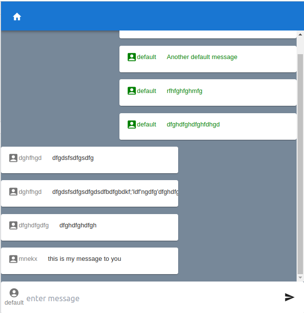

# Chatroom

## Screenshot 

> An app simulating live chat on a single browser. All messages are stored on local storage and each new tap opened is a new chatroom user.

## Built With

- React
- Redux

## Getting Started

### Setup

1. git clone https://github.com/mnekx/chatroom.git
2. cd chatroom
3. npm install
4. npm start to serve into local 3000 port
10. npm start
11. access the app on http://localhost:3000/
12. For every new user please use the '/' route to enter the chatroom

## Authors

👤 **Mnemba Chambuya**

- GitHub: [@mnekx](https://github.com/mnekx)
- Twitter: [@MnembaChambuya](https://twitter.com/MnembaChambuya)
- LinkedIn: [mnemba-chambuya](https://linkedin.com/in/mnemba-chambuya)

## 🤝 Contributing

Contributions, issues, and feature requests are welcome!

Feel free to check the [issues page](../../issues/).

## Show your support

Give a ⭐️ if you like this project!

## 📝 License

This project is [MIT](./MIT.md) licensed.